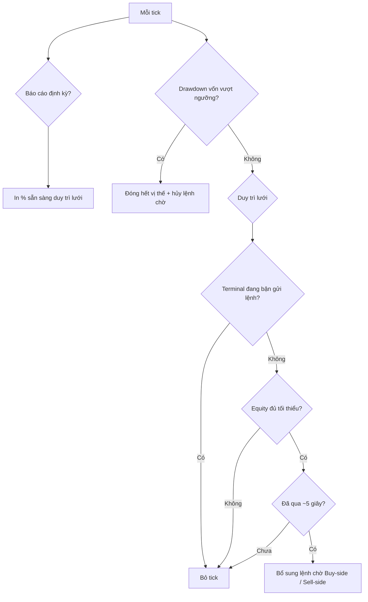

<!-- Generated by SpecStory, Markdown v2.1.0 -->

# 2026-05-12 02:16:39Z

<!-- Cursor IDE Session 9f8a6040-5a72-4ba9-b26f-8bf626271433 (2026-05-12 02:16:39Z) -->

_**User**_

@Pending_tread.mq5 phân tích và giải thích thuật toán theo ngôn ngữ của trader

---

_**Agent (default)**_

Đang đọc `Pending_tread.mq5` và tài liệu liên quan để giải thích thuật toán bằng ngôn ngữ trader.

_**Agent (default)**_

<tool-use data-tool-type="read" data-tool-name="read_file_v2">

Tool use: **read_file_v2** • Read file: C:\Users\workw\Downloads\git\Expert-Advisor-trading-bot\Pending_tread.mq5

</tool-use>

<tool-use data-tool-type="read" data-tool-name="read_file_v2">

Tool use: **read_file_v2**

</tool-use>

_**Agent (default)**_

<tool-use data-tool-type="read" data-tool-name="read_file_v2">

Tool use: **read_file_v2** • Read file: C:\Users\workw\Downloads\git\Expert-Advisor-trading-bot\public\THUAT_TOAN_PENDING_TREAD_CHI_TIET.md

</tool-use>

<tool-use data-tool-type="read" data-tool-name="read_file_v2">

Tool use: **read_file_v2**

</tool-use>

_**Agent (default)**_

<think>

Thought Process

The user requests an analysis and explanation of the algorithm in Pending_tread.
</think>

_**Agent (default)**_

## EA này làm gì?

`Pending_tread.mq5` là EA **lưới lệnh chờ** quanh giá hiện tại: không đọc nến hay chỉ báo, chỉ **giữ đủ số lệnh chờ** trên và dưới thị trường theo khoảng cách pip bạn cấu hình. Mỗi tick nó kiểm tra điều kiện vốn, rồi bổ sung lệnh chờ còn thiếu.

---

## Hai phía lưới

EA chia thị trường thành **phía trên** và **phía dưới** giá (mặc định: trên dùng **Ask**, dưới dùng **Bid**).

| Phía | Input mặc định | Loại lệnh chờ | Ý nghĩa với trader |
|------|----------------|---------------|-------------------|
| Trên thị trường | `AboveMarketTradeType = "BUY"` | **Buy Stop** | Chờ giá **phá lên** rồi vào **long** |
| Dưới thị trường | `BelowMarketTradeType = "SELL"` | **Sell Stop** | Chờ giá **phá xuống** rồi vào **short** |

Đổi `BUY`/`SELL` ở mỗi phía thì loại lệnh đổi theo (ví dụ trên thị trường + `SELL` → **Sell Limit** — bán khi giá hồi lên vùng trên).

Mỗi phía cố định **10** lệnh chờ (`totalOrdersPerSide` trong code, không có input). EA đếm lệnh chờ cùng symbol, magic, đúng loại; thiếu bao nhiêu thì đặt bấy nhiêu.

---

## Cách đặt giá vào lệnh, TP, SL

- **Bước lưới:** `PipStep` (mặc định 100 pip; symbol 3/5 chữ số thì EA nhân 10 khi quy đổi pip → point).
- **Mức thứ *j*+1** (j = 0…9): cách giá tham chiếu **(j+1) × PipStep**.
- **Khối lượng:** `LotSize`, chuẩn hóa theo broker.
- **TP:** `TakeProfitPips` tính từ **giá vào lệnh**.
- **SL:** `StopLossPips` nếu `EnableStopLoss = true`.
- **Slippage:** `Slippage` khi đóng vị thế trong bảo vệ vốn.

Ví dụ mặc định (breakout hai phía): Buy Stop dưới Ask +100, +200, … pip; Sell Stop trên Bid −100, −200, … pip. Mỗi lệnh khớp có TP/SL riêng theo pip — **không** trailing, **không** gom basket, **không** martingale trong EA.

Broker có **khoảng cách tối thiểu** (stops level): mức quá gần giá thì EA **bỏ qua** mức đó, không ép đặt.

---

## Một vòng tick (thứ tự ưu tiên)

**Báo cáo định kỳ** (`EnablePeriodicStatus`, mặc định 60 giây): chỉ log — equity, chỗ trống lưới, cooldown, symbol có giao dịch được không — **không** đặt/hủy lệnh.

**Bảo vệ lỗ vốn** (`EnableEquityLossProtection`, mặc định 20% so với **số dư lúc gắn EA**): equity ≤ ngưỡng → đóng mọi vị thế, hủy lệnh chờ của magic, **dừng duy trì lưới** tick đó.

**Duy trì lưới:** terminal không “bận”; equity ≥ `MinimumEquity`; tối đa **một lần bổ sung lưới / ~5 giây**; rồi lần lượt phía Buy và Sell nếu bật.

---

## Khi lệnh chờ khớp

EA chỉ đếm **lệnh chờ** (placed), không đếm vị thế đang mở. Khớp một pending → số chờ giảm → sau cooldown EA **đặt thêm** pending mới quanh giá hiện tại. Vị thế mở chạy theo **TP/SL trên lệnh**; EA **không** quản lý trailing hay đóng basket.

Nhiều lệnh khớp cùng hướng → nhiều vị thế cùng lot, cùng magic — **không** gộp P/L theo nhóm trong logic EA.

---

## Rủi ro và giới hạn (góc trader)

- **Hai phía breakout** (mặc định): sideway có thể ít kích hoạt; **range hẹp dao động mạnh** có thể kích hoạt cả long lẫn short — phơi nhiễm hai chiều.
- **Lưới dày, bước cố định:** không co giãn theo ATR/volatility; XAUUSD scalping cần chỉnh `PipStep`, TP, SL cho spread và stops level broker.
- **Trần 10 lệnh / phía** là cứng trong code.
- **Ngưỡng lỗ** tính từ số dư **lúc attach EA**, không reset theo ngày hay equity cao nhất.
- **Magic** (`MagicNumber`) tách lệnh EA; lệnh tay khác magic không bị logic lưới đụng tới (trừ khi chung tài khoản bị drawdown chung).

---

## Tóm lại

Đây là **máy duy trì lưới pending** quanh giá: mặc định **Buy Stop trên** và **Sell Stop dưới**, bước `PipStep`, TP/SL theo pip, lot cố định, cooldown ~5 giây, lọc equity tối thiểu và cắt khi drawdown % vượt ngưỡng. Không phải EA “đọc setup nến”; hành vi thực tế phụ thuộc **cấu hình BUY/SELL từng phía**, symbol, spread và chế độ thị trường.
