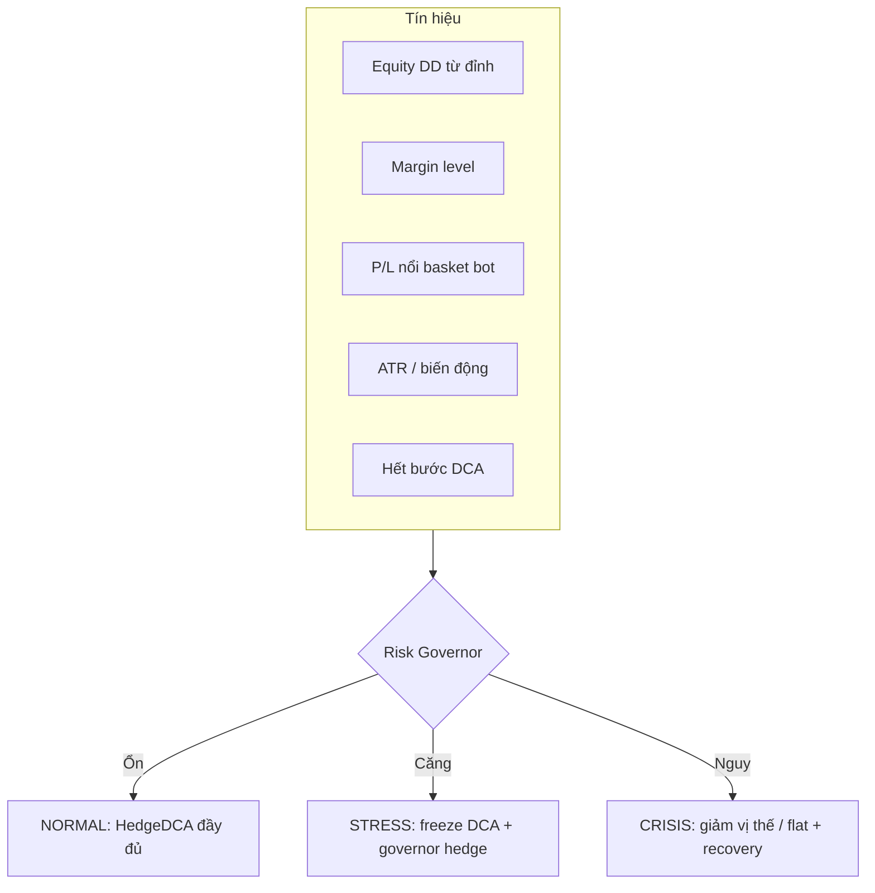

# HedgeDCA — Lớp phòng hộ thứ hai (meta-hedge) và cải tiến thuật toán gốc

Tài liệu này giải thích **vì sao** HedgeDCA Lock Side dễ **cháy tài khoản** khi gặp **sóng lớn / trend mạnh**, đề xuất một **lớp thứ hai** (phòng hộ của phòng hộ) có thể triển khai trong hệ thống giao dịch, và liệt kê **cải tiến cụ thể** cho thuật toán HedgeDCA hiện tại (`HedgeDCA_LockSide.mq5` và họ chiến lược tương tự).

Tham chiếu nhanh: `HedgeDCA_LockSide_algorithm.md`, `HedgeDCA_LockSide_phan_tich_chi_tiet.md`.

---

## 1. Vì sao HedgeDCA “dễ cháy” khi sóng lớn?

### 1.1. Bản chất rủi ro

HedgeDCA không phải bảo hiểm trung lập rủi ro; đó là **lưới hai phía + DCA theo cực trị giá + martingale (có trần)**. Khi thị trường **dịch chuyển có hướng mạnh và kéo dài**:

1. **Một phía DCA liên tục** — giá đi một chiều làm điều kiện “thêm lệnh theo bước” lặp lại; phía còn lại có thể chốt lãi nhiều vòng nhưng **tổng P/L vẫn lỗ** vì phía thua tích lũy nhanh hơn (đặc biệt sau khi no-lock đóng phía thắng).
2. **Martingale / tăng lot** — dù có làm tròn lot, các bậc sau vẫn làm **tăng tốc exposure**; sóng lớn đẩy bạn vào vùng bậc cao trước khi có đủ hồi quy mean.
3. **Trần `InpMaxTotalLot`** — khi đạt trần, EA **ngừng DCA** nhưng **không tự giải quyết** basket đang lỗ; giá tiếp tục đi xấu → **lỗ nổi vẫn phình** (drawdown USD, margin).
4. **MaxDD USD** là **chặn cuối** — thường tương đương “chấp nhận mất một cục lớn rồi đóng hết”. Trên sóng cực lớn, người dùng hay đặt MaxDD quá rộng hoặc quá hẹp: rộng thì **cháy margin trước**; hẹp thì **cắt lỗ liên tục** (death by thousand cuts) nếu AutoRestart bật.
5. **Spread, trượt giá, gap** — pip basket lý thuyết không bao hết chi phí; tin tức / mở cửa phiên làm **Ask/Bid nhảy** — basket “đẹp trên giấy” có thể xấu trên tiền.
6. **Ký quỹ (margin)** — hedge hai phía **không** giảm yêu cầu ký quỹ theo nghĩa an toàn tuyệt đối; tổng lot lớn + biến động có thể kích hoạt **margin call / stop-out** trước cả khi logic EA kịp phản ứng.

**Kết luận:** sóng lớn biến chiến lược từ “gom dao động” thành **carry một vị thế thua nặng một phía** (hoặc basket lệch), trong khi phanh `MaxTotalLot` và `MaxDD` chỉ **giới hạn tốc độ cháy**, không đảo chiều cấu trúc rủi ro.

---

## 2. Khái niệm “lớp thứ hai” — phòng hộ của phòng hộ

**Lớp 1 (hiện có):** hedge trong symbol + DCA + lock + trần lot + MaxDD.

**Lớp 2 (đề xuất):** một **bộ điều phối rủi ro tài khoản** (có thể là module trong cùng EA hoặc EA/ service riêng) hoạt động trên **chỉ số căng thẳng** (stress) của tài khoản và của basket HedgeDCA, kích hoạt **chính sách khác hẳn** so với vận hành bình thường: *giảm tốc vào rủi ro*, *tạo hedge ngoài lưới*, hoặc *thoát có kiểm soát* **trước** khi lớp 1 chạm ngưỡng thảm họa.

Lớp 2 **không** cố gắng “chắc chắn hòa vốn”; mục tiêu là:

- **Bảo toàn vốn còn lại** (equity) và **khả năng sống sót** (margin level).
- **Giảm xác suất stop-out** khi HedgeDCA đã ở trạng thái “ngoài thiết kế” (trend cực mạnh, spread phình, DCA cạn bước).

---

## 3. Kiến trúc đề xuất: bộ điều phối ba tầng trạng thái

Đặt **Risk Governor** với ba trạng thái (có thể mở rộng):

| Trạng thái | Ý nghĩa vận hành |
|------------|-------------------|
| **NORMAL** | HedgeDCA chạy đúng tham số hiện tại. |
| **STRESS** | Sóng / DD / margin bắt đầu nguy hiểm: **không mở DCA mới** (hoặc chỉ cho phép DCA “nhẹ”), tăng bước DCA ảo, bật hedge phụ có giới hạn. |
| **CRISIS** | Nguy cơ cháy margin / DD vượt ngưỡng đỏ: **đóng bớt có chủ đích**, hedge khẩn, hoặc **đóng toàn bộ** + chế độ phục hồi (recovery) với lot siêu nhỏ và cooldown. |

### 3.1. Tín hiệu kích hoạt (ví dụ — có thể kết hợp AND/OR)

- **Equity drawdown từ đỉnh phiên / đỉnh rolling** ≥ `DD_Equity_Stress%` / `DD_Equity_Crisis%`.
- **Floating loss USD** của magic HedgeDCA ≤ −`L1` (soft) hoặc ≤ −`L2` (hard) — *tách biệt* với MaxDD hiện tại để có hai ngưỡng.
- **Margin level** ≤ ngưỡng (ví dụ 200% → STRESS, 120% → CRISIS) — tùy broker và tài khoản.
- **Hết room DCA**: số lệnh một phía đạt `1 + InpMaxDcaAdds` **và** giá vẫn đi xấu cho basket đó.
- **Biến động thị trường**: ATR(14) / ATR baseline > k (ví dụ > 2.5) hoặc BB width percentile cao — **sóng lớn thống kê**, không chỉ “lỗ vài pip”.
- **Tốc độ xấu**: floating loss giảm (âm hơn) nhanh hơn X USD/phút trong cửa sổ thời gian.

### 3.2. Hành động theo tầng (đề xuất ưu tiên an toàn margin)

---

## 4. Phương án lớp 2 cụ thể (chọn và kết hợp)

### 4.1. Phương án A — “Freeze + nới bước ảo” (ít rủi ro nhất về margin)

- Khi STRESS: **cấm mở bất kỳ DCA mới**; chỉ cho phép logic **chốt basket** theo lock / TP đã có.
- Đồng thời **tăng ngưỡng pip chốt** tạm thời hoặc cho phép **partial close** nhỏ phía thắng để hạ exposure (nếu có triển khai partial).

**Ưu:** không nhân đôi margin. **Nhược:** không cứu được nếu basket đã quá xấu và không có đường thoát pip.

### 4.2. Phương án B — Hedge khẩn **cùng symbol** (defensive overlay)

- Khi STRESS và **net exposure** rõ (ví dụ tổng lot BUY ≫ SELL): mở một lệnh **SELL** cố định lot (hoặc basket nhỏ) với **SL/TP cứng** hoặc time-based exit — đóng vai trò **bảo hiểm ngắn hạn**.

**Ưu:** phản ứng nhanh, không cần symbol khác. **Nhược:** dễ **over-hedge** hoặc tạo thêm “rối ticket”; cần magic/comment riêng và quy tắc đóng không xung đột với lock hiện tại.

### 4.3. Phương án C — Hedge **cross-symbol** (meta-hedge thực sự)

- Cấu hình **cặp tương quan âm** (ví dụ XAU vs chỉ số / USD index / cặp tiền — *phải đo correlation trên dữ liệu thực tế*, không copy mù quáng).
- Khi CRISIS: mở vị thế trên symbol B với **lot theo beta ước lượng** sao cho biến động P/L tổ hợp **giảm nhạy** với kịch bản đang làm tổn thương tài khoản.

**Ưu:** tách một phần rủi ro ra khỏi lưới HedgeDCA. **Nhược:** tương quan **vỡ** trong khủng hoảng; tốn thêm margin; cần giám sát **tổng rủi ro tài khoản**.

### 4.4. Phương án D — **Hai EA / hai magic** (khuyến nghị kiến trúc)

- **EA1:** HedgeDCA (chiến lược gốc).
- **EA2:** “AccountGuard” chỉ đọc P/L theo magic EA1 + equity/margin toàn tài khoản; **không** xen vào lock/TP của EA1 trừ khi ở STRESS/CRISIS (đóng theo ticket filter, hoặc chỉ đặt overlay hedge).

**Ưu:** tách logic, dễ test, dễ tắt từng phần. **Nhược:** cần quy ước không double-open cùng hướng.

### 4.5. Phương án E — **Recovery mode** sau CRISIS

- Sau khi flat hoặc sau khi cắt gọn: **không** restart với `InpInitLot` cũ ngay; vào chế độ **init lot giảm (ví dụ /2 hoặc /5)**, **cooldown N phút/giờ**, `MaxTotalLot` tạm hạ, `DcaStep` tạm tăng.
- Chỉ trở lại NORMAL sau khi equity phục hồi hoặc sau N chu kỳ lợi nhuận nhỏ ổn định.

**Ưu:** giảm chuỗi cháy liên tiếp sau một sóng. **Nhược:** bỏ lỡ cơ hội nếu thị trường quay đầu ngay.

### 4.6. Phương án F — **Can thiệp con người + nút “break glass”**

- Global variable / file flag: khi trader bật, lớp 2 **ưu tiên tuyệt đối** đóng % lot phía thua hoặc toàn bộ.
- Không thay thế tự động hoàn toàn nhưng là **lớp vận hành** quan trọng trong thực chiến.

---

## 5. Rủi ro khi thêm lớp 2 (cần thiết kế để tránh “cháy nhanh hơn”)

| Rủi ro | Mô tả |
|--------|--------|
| Nhân đôi margin | Hedge thêm có thể làm **margin level tụt nhanh** nếu không tính trướn. |
| Correlation breakdown | Cross-hedge có thể **cùng lỗ** với XAU trong stress hệ thống. |
| Xung đột logic | Overlay cùng symbol có thể phá luật lock/DCA nếu không tách magic và thứ tự đóng lệnh. |
| Over-trading | Nhiều ngưỡng → nhiều lần đóng/mở → phí ăn mòn. |

**Nguyên tắc:** lớp 2 ưu tiên **giảm exposure và margin** trước khi thêm vị thế phức tạp; mọi overlay nên có **trần lot** và **thời gian sống** (timeout).

---

## 6. Cải tiến đề xuất cho thuật toán HedgeDCA **gốc** (song song với lớp 2)

Các mục dưới đây tăng khả năng **sống sót** và giảm xác suất vào CRISIS; triển khai dần trong `HedgeDCA_LockSide.mq5` hoặc bản fork.

1. **Hai ngưỡng MaxDD** — Soft: freeze DCA + log cảnh báo; Hard: đóng hết (hiện tại gần như chỉ có một kiểu cắt).
2. **Giám sát margin level** — tạm dừng mở lệnh khi dưới ngưỡng; ưu tiên giảm lot phía làm tăng margin pressure.
3. **Điều chỉnh bước DCA theo ATR** — sóng lớn → bước lớn hơn → ít lệnh hơn trên cùng quãng giá.
4. **Buffer spread vào điều kiện TP pip** — tránh chốt “ảo” so với thực tế USD.
5. **Commission trong basket P/L** — dùng ước lượng hoặc `DEAL_COMMISSION` tích lũy khi quyết định đóng nhóm.
6. **OnTimer + cờ** — giảm tải tick; logic stress không cần chạy mỗi tick.
7. **Retry đóng lệnh** — giảm rủi ro lệnh sót khi biến động mạnh.
8. **Filter giờ / tin** — không DCA mới khi spread > ngưỡng hoặc trong cửa sổ tin NFP/FOMC (cấu hình được).
9. **Partial close có kế hoạch** — giảm dần phía thua khi phía thắng đạt mốc (phức tạp nhưng giảm “nhị phân” đóng hết một phía).
10. **Asymmetric mult** — cho phép nhánh trend-history của symbol yếu hơn (cần backtest kỹ, không mặc định bật).
11. **Session equity peak reset** — DD tính trên đỉnh phiên để tránh “kéo dài âm tính” không nhạy.
12. **Tài liệu hóa `g_ddHalt` + AutoRestart** — tránh trader hiểu nhầm bot “tự tắt vĩnh viễn”.

---

## 7. Lộ trình triển khai gợi ý (ưu tiên)

| Giai đoạn | Việc làm |
|-----------|----------|
| **P0** | Thêm STRESS chỉ với **freeze DCA** + log + điều kiện margin level (Phương án A + margin). |
| **P1** | Soft/Hard DD tách đôi + Recovery mode (Phương án E). |
| **P2** | Tách EA AccountGuard (Phương án D) hoặc module `#ifdef`/include riêng. |
| **P3** | Overlay hedge cùng symbol có SL/TP + timeout (Phương án B). |
| **P4** | Cross-symbol meta-hedge có beta và trần lot (Phương án C) — chỉ sau khi có dữ liệu tương quan. |

### 7.1. Cấu trúc file EA (tách BASE / P0–P4)

Logic nằm trong `HedgeDCA_LockSide_core.mqh` với `#define HDCA_VARIANT` (0, 10, 20, 30, 40, 50 và các bản gộp 110, 120, 130, 210). Mỗi EA compile một biến thể:

| File `.mq5` | `HDCA_VARIANT` | Nội dung riêng |
|--------------|----------------|----------------|
| `HedgeDCA_LockSide.mq5` | 0 | BASE — không RiskGov |
| `HedgeDCA_LockSide_p0.mq5` | 10 | Freeze DCA: margin % + lỗ nổi bot (P0) |
| `HedgeDCA_LockSide_p1.mq5` | 20 | Soft DD + recovery sau Hard DD (P1) |
| `HedgeDCA_LockSide_p2.mq5` | 30 | Spread (points) vượt ngưỡng → freeze DCA |
| `HedgeDCA_LockSide_p3.mq5` | 40 | Khoảng cách tối thiểu giữa hai lệnh DCA (giây) |
| `HedgeDCA_LockSide_p4.mq5` | 50 | Lỗ nổi **toàn tài khoản** (mọi vị thế) → freeze DCA |
| `HedgeDCA_LockSide_p0p1.mq5` | 110 | **P0 + P1**: margin/float + soft DD + recovery sau Hard DD |
| `HedgeDCA_LockSide_p0p2.mq5` | 120 | **P0 + P2**: margin/float + spread |
| `HedgeDCA_LockSide_p1p2.mq5` | 130 | **P1 + P2**: soft DD + recovery + spread |
| `HedgeDCA_LockSide_p0p1p2.mq5` | 210 | **P0 + P1 + P2** |

*Bảng P0–P4 mục 7 phía trên là ý tưởng tài liệu; bản build `_p2`…`_p4` trong repo là các lớp bảo vệ **đơn giản hóa** tương ứng từ khối “cải tiến” (spread / tần suất / toàn TK), không phải EA AccountGuard hay cross-hedge đầy đủ.*

---

## 8. Tuyên bố giới hạn trách nhiệm

Không có lớp phòng hộ nào **đảm bảo** không thua hoặc không stop-out. Mục tiêu thực tế là **quản trị xác suất và tốc độ tổn thất**. Mọi tham số cần **backtest / forward test** trên tài khoản demo và kiểm chứng margin theo điều kiện broker.

---

## 9. Tệp liên quan trong repo

- `mq5/HedgeDCA_LockSide.mq5` — triển khai HedgeDCA Lock Side.  
- `mq5/HedgeDCA_LockSide_algorithm.md` — mô tả thuật toán gốc.  
- `mq5/HedgeDCA_LockSide_phan_tich_chi_tiet.md` — phân tích tham số và rủi ro.  
- **Tài liệu này:** `mq5/HedgeDCA_Lop2_phong_ho_song_lon.md`
- **Core + biến thể:** `mq5/HedgeDCA_LockSide_core.mqh`, `HedgeDCA_LockSide.mq5`, `HedgeDCA_LockSide_p0.mq5` … `_p4.mq5`, `HedgeDCA_LockSide_p0p1.mq5`, `HedgeDCA_LockSide_p0p2.mq5`, `HedgeDCA_LockSide_p1p2.mq5`, `HedgeDCA_LockSide_p0p1p2.mq5`
