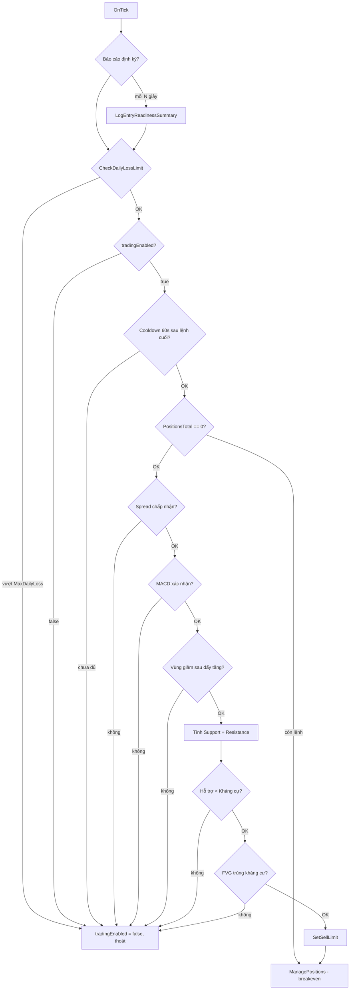

# Thuật toán giao dịch — `bot.mq5`

Tài liệu mô tả logic trade của Expert Advisor trong file [`bot.mq5`](bot.mq5). EA này là chiến lược **bán theo vùng cung (kháng cự)**, kết hợp **MACD**, **cấu trúc nến giảm sau đẩy tăng**, **hỗ trợ/kháng cự dạng fractal** và **Fair Value Gap (FVG)**. Khung thời gian phân tích: **M1 (1 phút)**.

---

## 1. Mục tiêu chiến lược

| Khía cạnh | Mô tả |
|-----------|--------|
| Hướng giao dịch | Chỉ **SELL** (không mở BUY) |
| Kiểu lệnh | **Sell Limit** tại mức kháng cự — chờ giá hồi lên vùng cung rồi khớp |
| Bối cảnh thị trường | Sau đợt **đẩy tăng** (nhiều nến xanh), xuất hiện **nến giảm mạnh** + MACD xác nhận đà giảm |
| Vùng giá | Vào lệnh gần **kháng cự**; SL phía trên; TP theo **R:R tối thiểu** (`MinRiskReward`) |
| Quản lý rủi ro | Khối lượng theo **số tiền rủi ro cố định** (`RiskAmount`); giới hạn **lỗ trong ngày**; tùy chọn lọc **spread** |
| Quản lý lệnh mở | Khi lợi nhuận ≥ 1R → **kéo SL về hòa vốn** (breakeven) |

EA **không** martingale, không hedge hai chiều, không DCA — mỗi chu kỳ chỉ đặt **một lệnh chờ** khi không có vị thế đang mở.

---

## 2. Tham số đầu vào

| Tham số | Mặc định | Ý nghĩa |
|---------|----------|---------|
| `InpLanguage` | Tiếng Việt | Ngôn ngữ log (`BOT_LANG_VI` / `BOT_LANG_EN`) |
| `RiskAmount` | 50 | Số tiền tài khoản chấp nhận mất nếu chạm SL (đơn vị tiền tệ TK) |
| `MaxDailyLoss` | 200 | Nếu lỗ trong ngày (so với balance đầu ngày) ≥ giá trị này → **dừng trade** |
| `LookbackPeriod` | 20 | Số nến M1 dùng tìm vùng hỗ trợ / kháng cự |
| `MinRiskReward` | 2.0 | Tỷ lệ lợi nhuận : rủi ro tối thiểu (TP cách entry ≥ 2× khoảng entry→support) |
| `MagicNumber` | 234567 | Magic nhận diện lệnh của EA |
| `EnableLogging` | true | In log chi tiết khi đặt lệnh / lỗi |
| `MaxSpreadPoints` | 0 | Spread tối đa (points); **0 = tắt** kiểm tra spread |
| `EnablePeriodicStatus` | true | Báo cáo định kỳ % điều kiện vào lệnh |
| `StatusIntervalSeconds` | 60 | Chu kỳ báo cáo (giây, tối thiểu 10) |

**Ràng buộc khi khởi động:** `RiskAmount > 0`, `MaxDailyLoss > 0`, `MinRiskReward > 1.0`. MACD phải tạo handle thành công (12, 26, 9, `PRICE_CLOSE`, M1).

---

## 3. Luồng xử lý mỗi tick (`OnTick`)



**Thứ tự ưu tiên:** Các bộ lọc an toàn (lỗ ngày, cooldown, không chồng lệnh, spread) chạy **trước** tín hiệu kỹ thuật. Chỉ khi **tất cả** điều kiện entry thỏa mới gọi `SetSellLimit`.

**Lưu ý:** `ManagePositions()` chỉ được gọi khi đã qua nhánh đặt lệnh (cuối `OnTick` sau `SetSellLimit`) hoặc khi `PositionsTotal() > 0` — tức là khi đang có vị thế, EA **bỏ qua** tìm tín hiệu mới và chỉ quản lý SL breakeven.

---

## 4. Chín điều kiện vào lệnh (báo cáo % sẵn sàng)

Hàm `LogEntryReadinessSummary()` đánh giá **9 điều kiện độc lập** và in % đạt (`passed/9`):

| # | Điều kiện | Hàm / logic |
|---|-----------|-------------|
| 1 | Chưa vượt lỗ ngày | `CheckDailyLossLimit` |
| 2 | Bot cho phép giao dịch | `tradingEnabled == true` |
| 3 | Đã qua 60 giây kể từ lệnh cuối | `TimeCurrent() - lastTradeTime >= 60` |
| 4 | Không có vị thế đang mở | `PositionsTotal() == 0` |
| 5 | Spread chấp nhận được | `IsSpreadAcceptable` |
| 6 | MACD xác nhận giảm | `CheckMACD` |
| 7 | Phát hiện vùng giảm | `DetectBearishZone` |
| 8 | Hỗ trợ & kháng cự hợp lệ | `support > 0`, `resistance > 0`, `support < resistance` |
| 9 | FVG căn kháng cự | `IsFVGAndResistanceAligned` |

Trên chart thực tế, điều kiện 8 và 9 phụ thuộc lẫn nhau (FVG chỉ kiểm tra khi S/R đã hợp lệ).

---

## 5. Chi tiết từng tín hiệu

### 5.1. MACD (`CheckMACD`)

- Chỉ báo: **MACD(12, 26, 9)** trên **M1**, giá đóng cửa.
- Đọc 3 giá trị gần nhất của đường MACD và Signal.

**Điều kiện đồng thời:**

1. **Giao cắt xuống:** `macdMain[0] < macdSignal[0]` **và** `macdMain[1] >= macdSignal[1]` (vừa cắt xuống dưới signal).
2. **Đà giảm:** `macdMain[0] < macdMain[1]` (histogram/đường MACD đang yếu đi so với bar trước).

→ Xác nhận momentum **bearish** ngắn hạn trước khi bán.

### 5.2. Vùng giảm sau đẩy tăng (`DetectBearishZone`)

Phân tích **10 nến M1** gần nhất (index 0 = nến hiện tại).

| Bước | Logic |
|------|--------|
| Đẩy tăng trước đó | Trong các nến index 5→8, đếm nến tăng (`close > open`). Cần **≥ 3** nến tăng → `hadBullishPush` |
| Nến hiện tại giảm | `close[0] < open[0]` |
| Nến giảm “đáng kể” | Thân nến hiện tại > **1.5 ×** thân trung bình của 5 nến trước (`avgBodySize`) |

→ Mô hình: thị trường **đã tăng**, rồi **từ chối mạnh** bằng nến đỏ lớn — phù hợp setup bán tại kháng cự.

### 5.3. Hỗ trợ & kháng cự (`IdentifySupportZone` / `IdentifyResistanceZone`)

- Lấy `LookbackPeriod + 5` nến **low** (hỗ trợ) hoặc **high** (kháng cự).
- **Fractal đơn giản:** điểm `i` là đáy cục bộ nếu `low[i]` ≤ 2 nến trái và ≤ 2 nến phải (tương tự đỉnh cho kháng cự).
- Với mỗi fractal, đếm số lần giá **chạm gần** mức đó (sai số ≤ `5 * Point()`).
- Chọn mức có **nhiều lần chạm nhất** làm support/resistance chính.

**Yêu cầu:** `support < resistance`. Nếu không → bỏ qua, không đặt lệnh.

### 5.4. FVG và kháng cự (`IsFVGAndResistanceAligned`)

Định nghĩa FVG đơn giản trên M1:

- `fvgStart` = **Low** của nến cách hiện tại 2 bar (`iLow(..., 2)`)
- `fvgEnd` = **High** của nến hiện tại (`iHigh(..., 0)`)

**Điều kiện căn kháng cự:**

```
fvgStart < resistance  AND  fvgEnd > resistance
```

→ Khoảng trống giá (gap) **bao trùm** mức kháng cự — giá có thể hồi vào vùng inefficiency trước khi tiếp tục giảm.

---

## 6. Đặt lệnh — `SetSellLimit`

Khi tất cả filter + tín hiệu thỏa:

| Thành phần | Công thức |
|------------|-----------|
| **Entry** | `entryPrice = resistance` (Sell Limit tại kháng cự) |
| **Stop Loss** | `stopLoss = resistance + (resistance - support) * 0.5` — SL nằm **phía trên** entry, khoảng cách = **50%** biên độ support→resistance |
| **Khoảng R (tham chiếu)** | `riskRewardDistance = entryPrice - support` |
| **Take Profit** | `takeProfit = entryPrice - (riskRewardDistance * MinRiskReward)` — TP **dưới** entry, tối thiểu `MinRiskReward` lần khoảng entry→support |

**Kiểm tra hợp lệ:** `stopLoss > entryPrice` và `takeProfit < entryPrice`. Nếu sai → không gửi lệnh.

**Khối lượng:** `CalculateLotSize(RiskAmount, stopLoss, entryPrice)` — xem mục 7.

**Lệnh gửi đi:**

- `ORDER_TYPE_SELL_LIMIT`
- `TRADE_ACTION_PENDING`
- Magic = `MagicNumber`
- `ORDER_FILLING_IOC`
- Sau khi đặt thành công: `lastTradeTime = TimeCurrent()` (kích hoạt cooldown 60s).

---

## 7. Tính khối lượng (`CalculateLotSize`)

Mục tiêu: mỗi lệnh chỉ rủi ro tối đa **`RiskAmount`** nếu chạm SL.

```
riskDistance = |stopLoss - entryPrice|
riskInTicks  = riskDistance / tickSize
lotSize      = RiskAmount / (riskInTicks * tickValue)
```

- Làm tròn theo `SYMBOL_VOLUME_STEP`, kẹp trong `[minLot, maxLot]`.
- **Trần bổ sung:** lot không được vượt quá rủi ro **5% equity** tài khoản trên cùng khoảng SL (`maxAllowedLot`).

Nếu tham số symbol (tick value/size) không hợp lệ hoặc `riskDistance <= 0` → trả về 0, không trade.

---

## 8. Quản lý rủi ro & vị thế

### 8.1. Giới hạn lỗ trong ngày

- Khi `OnInit`: `dailyStartBalance = AccountInfoDouble(ACCOUNT_BALANCE)`.
- Mỗi tick: `dailyLoss = dailyStartBalance - currentBalance`.
- Nếu `dailyLoss >= MaxDailyLoss` → `tradingEnabled = false`, EA **không** tìm tín hiệu mới cho đến khi restart (balance đầu ngày **không** tự reset lúc 00:00 — chỉ reset khi attach EA lại).

### 8.2. Lọc spread

- `MaxSpreadPoints <= 0`: luôn cho phép.
- Ngược lại: `SYMBOL_SPREAD` (points) phải ≤ `MaxSpreadPoints`.

### 8.3. Cooldown

- Sau mỗi lệnh chờ đặt thành công: **60 giây** không đặt lệnh mới (kể cả khi lệnh limit chưa khớp).

### 8.4. Một vị thế tại một thời điểm

- `PositionsTotal() > 0` → không đánh giá entry mới; chỉ `ManagePositions`.

### 8.5. Breakeven (`ManagePositions`)

Áp dụng cho vị thế **SELL** của symbol + magic EA:

```
riskDistance   = openPrice - stopLoss
currentProfit  = openPrice - currentPrice   // lợi nhuận theo giá (SELL)
```

Khi `currentProfit >= riskDistance` (đã lãi ≥ **1R**) **và** SL chưa ở hòa vốn:

- Gửi `TRADE_ACTION_SLTP` đặt `sl = openPrice` (breakeven), giữ nguyên TP.

---

## 9. Khởi tạo & thoát EA

| Sự kiện | Hành vi |
|---------|---------|
| `OnInit` | Tạo MACD M1; lưu balance đầu ngày; validate input |
| `OnDeinit` | `IndicatorRelease(macdHandle)` |

---

## 10. Điểm mạnh & hạn chế (để backtest / live)

**Điểm mạnh**

- Nhiều lớp lọc (MACD + price action + S/R + FVG) giảm vào lệnh ngẫu nhiên.
- R:R cố định tối thiểu; lot theo tiền rủi ro; breakeven bảo vệ lãi 1R.
- Giới hạn lỗ ngày và spread; log đa ngôn ngữ và báo cáo % sẵn sàng.

**Hạn chế / cần lưu ý**

- **Chỉ SELL** — không trade xu hướng tăng.
- **Sell Limit** tại kháng cự có thể **không khớp** nếu giá không hồi đủ.
- FVG và fractal S/R là **heuristic đơn giản**, không phải ICT/SMC đầy đủ.
- `dailyStartBalance` không reset theo lịch server — cần restart EA đầu phiên nếu muốn reset lỗ ngày.
- Cooldown 60s và “chỉ 1 vị thế” hạn chế tần suất trade.
- Không quản lý lệnh chờ hết hạn / hủy limit khi điều kiện đảo chiều.

---

## 11. Tóm tắt một dòng

> **Chờ sau đợt tăng có nến giảm mạnh + MACD cắt xuống, xác định hỗ trợ/kháng cự fractal và FVG qua kháng cự, đặt Sell Limit tại kháng cự với SL trên và TP ≥ 2R xuống support, lot theo `RiskAmount`, kéo SL hòa vốn khi lãi 1R, dừng khi lỗ ngày đạt `MaxDailyLoss`.**

---

*Tài liệu đồng bộ với mã nguồn `mq5/bot.mq5` tại thời điểm tạo file.*
