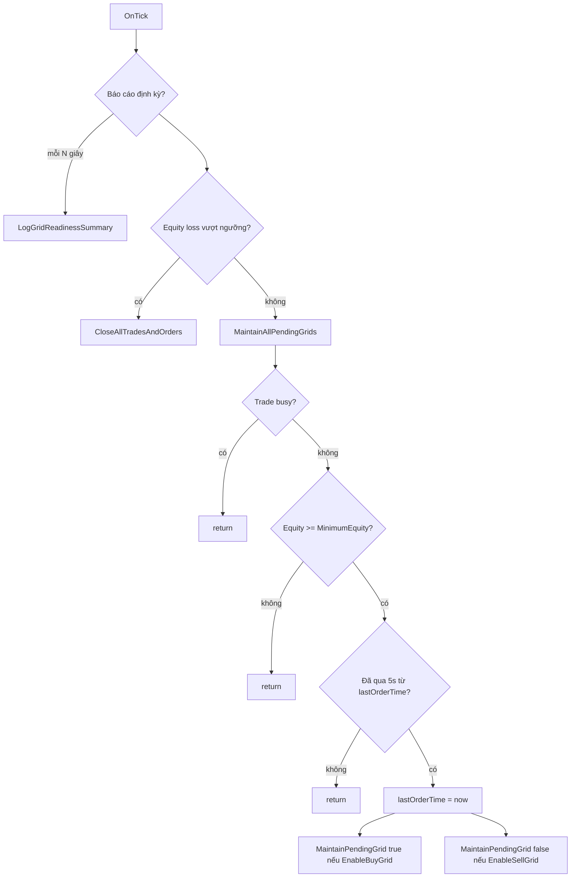

# Thuật toán chi tiết — EA Pending_tread.mq5

Tài liệu mô tả **luồng xử lý**, **công thức giá**, và **điều kiện** trong file `Pending_tread.mq5` (bản đã bổ sung báo cáo định kỳ). Ngôn ngữ: **Tiếng Việt**.

---

## 1. Mục tiêu thiết kế

EA thực hiện **chiến lược lưới lệnh chờ (pending grid)**:

- Duy trì một số cố định lệnh chờ **phía trên** và/hoặc **phía dưới** giá thị trường.
- Khoảng cách giữa các mức giá theo tham số **PipStep** (quy đổi sang **point** của symbol).
- Mỗi lệnh chờ có **Take Profit** và tùy chọn **Stop Loss** theo pip.
- Có **lọc equity tối thiểu** và **bảo vệ lỗ theo %** so với số dư lúc `OnInit`.

Không có tín hiệu indicator phức tạp: logic là **duy trì cấu trúc lưới**, không phải EA breakout theo nến đơn lẻ.

---

## 2. Cấu trúc tổng thể

---

## 3. Khởi tạo — `OnInit`

1. Gán `startingBalance = AccountInfoDouble(ACCOUNT_BALANCE)` — dùng cho **MaxLossPercent**.
2. Nếu bật báo cáo định kỳ và `0 < StatusIntervalSeconds < 10` → trả về `INIT_FAILED` (bắt buộc tối thiểu 10 giây).
3. `lastStatusLogTime = TimeCurrent()` để chu kỳ báo cáo bắt đầu gọn.

---

## 4. Chu kỳ tick — `OnTick`

### 4.1. Báo cáo định kỳ (không chặn giao dịch)

Nếu `EnablePeriodicStatus` và `StatusIntervalSeconds > 0`:

- Khi `TimeCurrent() - lastStatusLogTime >= StatusIntervalSeconds` → gọi `LogGridReadinessSummary()`, cập nhật `lastStatusLogTime`.

Hàm này **chỉ đọc** trạng thái tài khoản / lệnh / symbol và `Print` — không đặt hay hủy lệnh.

### 4.2. Bảo vệ lỗ vốn

Nếu `EnableEquityLossProtection` và `CheckEquityLossExceeded()`:

- In log cảnh báo, gọi `CloseAllTradesAndOrders()`, **return** (không duy trì lưới trong tick đó).

### 4.3. Duy trì lưới — `MaintainAllPendingGrids`

Thứ tự kiểm tra:

1. **`TradeIsBusy()`** — nếu `trade.ResultRetcode()` thuộc `{10010, 10011, 10006}` → coi context đang bận, **return** (tránh spam lệnh).
2. **`ACCOUNT_EQUITY < MinimumEquity`** → **return** (không đặt thêm lệnh chờ).
3. **`TimeCurrent() - lastOrderTime < 5`** → **return** (giới hạn tần suất xử lý lưới tối đa mỗi ~5 giây).
4. Gán `lastOrderTime = TimeCurrent()`.
5. Nếu `EnableBuyGrid` → `MaintainPendingGrid(true)`.
6. Nếu `EnableSellGrid` → `MaintainPendingGrid(false)`.

---

## 5. Ngưỡng lỗ equity — `CheckEquityLossExceeded`

- `limitEquity = startingBalance * (1 - MaxLossPercent/100)`.
- Trả về **true** nếu `AccountInfoDouble(ACCOUNT_EQUITY) <= limitEquity`.

Nghĩa là equity giảm **ít nhất** `MaxLossPercent` % so với số dư **ban đầu khi EA start** (không phải high-water mark trong phiên).

---

## 6. Đóng toàn bộ — `CloseAllTradesAndOrders`

1. **Vị thế**: duyệt `PositionsTotal()`, với mỗi vị thế gọi `trade.PositionClose(symbol, Slippage)` — **lưu ý**: không lọc theo `MagicNumber` ở vòng lặp đóng position (chỉ magic khi xóa pending).
2. **Lệnh chờ**: duyệt `OrdersTotal()`, nếu `ORDER_MAGIC == MagicNumber` → `trade.OrderDelete(ticket)`.

---

## 7. Ánh xạ loại lệnh chờ — `GetPendingOrderType(above, direction)`

Tham số `direction` là chuỗi `"BUY"` hoặc `"SELL"` (so sánh trực tiếp với `AboveMarketTradeType` / `BelowMarketTradeType`).

| `above` | `direction` | Loại lệnh |
|---------|-------------|-----------|
| true (trên thị trường) | BUY | **ORDER_TYPE_BUY_STOP** |
| true | SELL | **ORDER_TYPE_SELL_LIMIT** |
| false (dưới thị trường) | BUY | **ORDER_TYPE_BUY_LIMIT** |
| false | SELL | **ORDER_TYPE_SELL_STOP** |

Ý nghĩa trực quan:

- **Trên giá**: Buy Stop / Sell Limit (tùy cấu hình).
- **Dưới giá**: Buy Limit / Sell Stop.

---

## 8. Duy trì một phía lưới — `MaintainPendingGrid(bool above)`

### 8.1. Biến giá và pip

- `pointSize = SYMBOL_POINT`.
- `digits = SYMBOL_DIGITS`.
- `stopLevelPoints = SYMBOL_TRADE_STOPS_LEVEL`, `stopDistance = stopLevelPoints * pointSize`.
- `marketPrice`: nếu `above` → **ASK**, ngược lại **BID**.
- **Hệ số pip**: `pipMultiplier = 10` nếu `digits == 3 || digits == 5`, ngược lại `1` (chuẩn hóa “pip” với broker 3/5 số lẻ).

Công thức bước giá:

- `pipStepPoints = PipStep * pipMultiplier * pointSize`
- `tpOffset = TakeProfitPips * pipMultiplier * pointSize`
- `slOffset = StopLossPips * pipMultiplier * pointSize`

### 8.2. Đếm lệnh chờ hiện có

Đếm các order thỏa đồng thời:

- `ORDER_SYMBOL == _Symbol`
- `ORDER_TYPE == pendingType` (theo bảng trên)
- `ORDER_MAGIC == MagicNumber`
- `ORDER_STATE == ORDER_STATE_PLACED`

Gọi số đếm là `existingCount`.

### 8.3. Vòng bổ sung lệnh

Với `j` từ `existingCount` đến `totalOrdersPerSide - 1` (mặc định 10 mỗi phía):

Tính `orderPrice`, `takeProfit`, `stopLoss` theo `switch(pendingType)`:

| Loại | Giá lệnh (rút gọn) | Điều kiện khoảng cách tối thiểu | TP | SL (nếu bật) |
|------|-------------------|----------------------------------|-----|----------------|
| BUY_STOP | `ASK + (j+1)*pipStepPoints` | `(orderPrice - ASK) >= stopDistance` | `orderPrice + tpOffset` | `orderPrice - slOffset` |
| SELL_STOP | `BID - (j+1)*pipStepPoints` | `(BID - orderPrice) >= stopDistance` | `orderPrice - tpOffset` | `orderPrice + slOffset` |
| BUY_LIMIT | `BID - (j+1)*pipStepPoints` | `(BID - orderPrice) >= stopDistance` | `orderPrice + tpOffset` | `orderPrice - slOffset` |
| SELL_LIMIT | `ASK + (j+1)*pipStepPoints` | `(orderPrice - ASK) >= stopDistance` | `orderPrice - tpOffset` | `orderPrice + slOffset` |

Nếu không đủ `stopDistance` → `continue` (bỏ qua mức `j` đó, không báo lỗi chi tiết trong vòng lặp).

### 8.4. Gửi lệnh

- `TRADE_ACTION_PENDING`, `ORDER_TIME_GTC`, `ORDER_FILLING_RETURN`, `comment = "Grid EA"`.
- `OrderSend(request, result)` — log `GetLastError` hoặc `result.retcode`.

### 8.5. Chuẩn hóa lot — `NormalizeLot`

Giới hạn trong `[SYMBOL_VOLUME_MIN, SYMBOL_VOLUME_MAX]`, làm tròn theo `SYMBOL_VOLUME_STEP`.

---

## 9. Báo cáo định kỳ — `LogGridReadinessSummary` (thuật toán %)

**Mục đích:** Cho người dùng một chỉ số **0–100%** phản ánh mức độ “sẵn sàng” để EA tiếp tục **chu kỳ duy trì lưới** (không đảm bảo lệnh gửi thành công).

**Bước:**

1. `nBuy = CountGridPending(true)`, `nSell = CountGridPending(false)` (cùng logic lọc như mục 8.2).
2. Tính 7 cờ boolean như trong bảng hướng dẫn sử dụng; mỗi cờ **true** cộng 1 vào `passed`.
3. `pct = round(100 * passed / 7)`.
4. `Print` tiêu đề, dòng %, dòng chi tiết Đạt/Chưa, dòng thống kê lệnh chờ và equity.

**Hàm phụ:**

- `CountGridPending(above)` — đếm pending một phía.
- `IsSymbolTradeEnabled()` — `SYMBOL_TRADE_MODE != SYMBOL_TRADE_MODE_DISABLED`.

---

## 10. Phân tích mã theo khối chức năng (ánh xạ file)

| Khối | Hàm / vùng | Nhiệm vụ |
|------|------------|----------|
| Input | Dòng `input` | Cấu hình lưới, rủi ro, magic, báo cáo, ngôn ngữ. |
| Global | `totalOrdersPerSide`, thời gian, balance | Trạng thái phiên làm việc. |
| Tiện ích | `NormalizeLot`, `L`, `StatusOk` | Lot broker + i18n log. |
| Vòng đời | `OnInit`, `OnTick` | Khởi tạo và vòng tick. |
| Rủi ro | `CheckEquityLossExceeded`, `CloseAllTradesAndOrders` | Cắt toàn bộ khi vượt ngưỡng. |
| Lưới | `MaintainAllPendingGrids`, `MaintainPendingGrid` | Duy trì số lệnh chờ. |
| Giao dịch | `TradeIsBusy`, `GetPendingOrderType`, `OrderSend` | Điều kiện context và đặt lệnh. |
| Giám sát | `LogGridReadinessSummary`, `CountGridPending`, `IsSymbolTradeEnabled` | Báo cáo % điều kiện. |

---

## 11. Hạn chế đã biết (từ code)

- **`PositionClose(symbol)`** trong vòng lặp có thể ảnh hưởng **mọi** vị thế trên **symbol** đó, không chỉ magic của EA — cần lưu ý nếu chạy nhiều EA cùng symbol.
- Lệnh chờ có thể **không đủ 10** nếu nhiều mức bị `continue` do **stops level**.
- So sánh chuỗi `direction == "BUY"` phân biệt hoa thường theo chuẩn MQL5 — nên nhập đúng `BUY`/`SELL` in hoa trong input.

---

## 12. Bản quyền và nguồn

Phần đầu file ghi: Copyright 2025, Mir Mostofa Kamal; liên kết MQL5. Mô tả gốc: EA pending tread, khuyến nghị scalping XAUUSD, cảnh báo rủi ro.

---

*Tài liệu kỹ thuật sinh ra để đi kèm repo; cập nhật khi logic `Pending_tread.mq5` thay đổi.*
